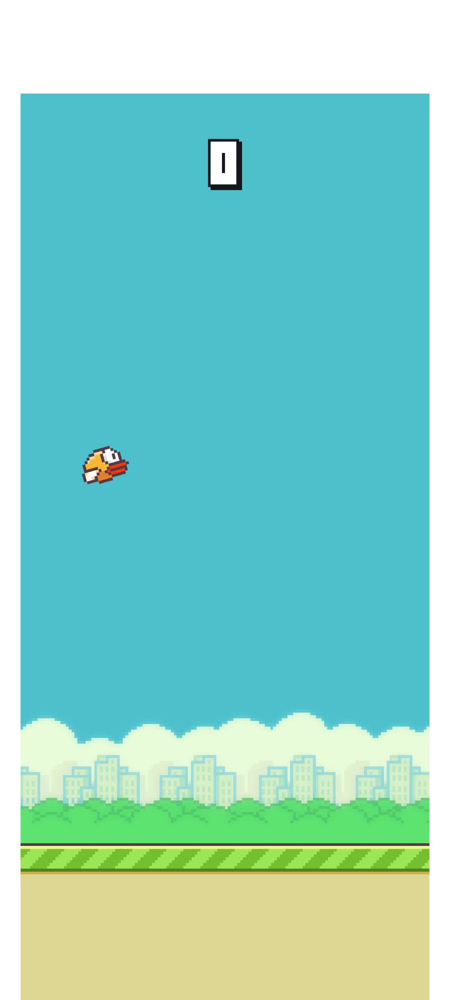
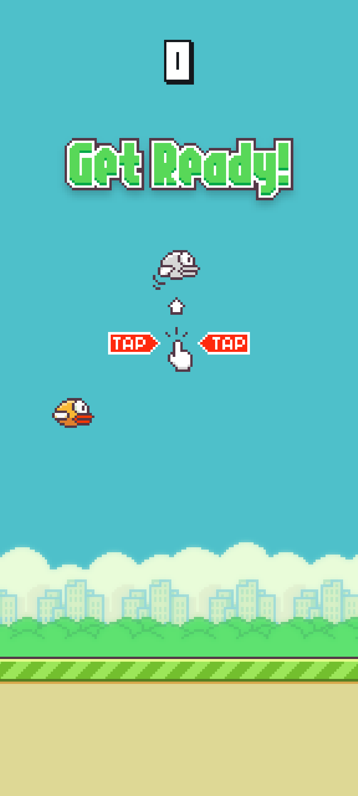
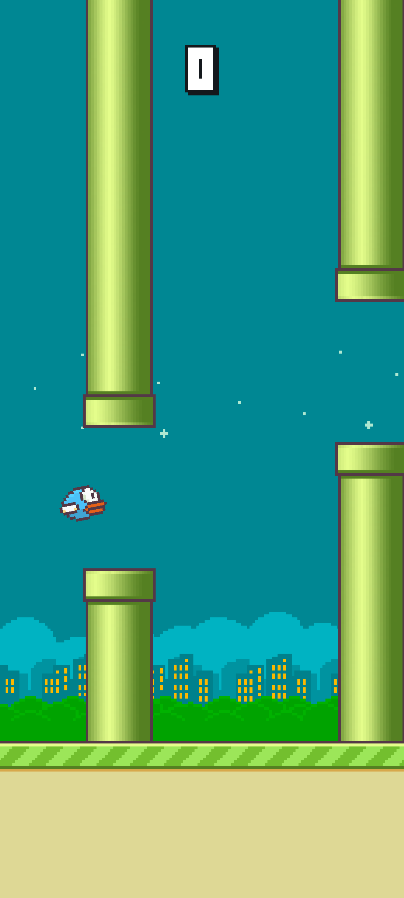

# FlappyBird 2026

The mobile game from 2013, rebuilt with the Godot game engine.

## Screenshots

 
 
 
 

## Download

[](https://play.google.com/store/apps/details?id=com.luminaapps.flappybird2026)
[](https://apps.apple.com/us/app/FlappyBird2026/id6760208185)

## Development

### Android export

For the export as Android package bundle the Java JDK needs to be installed.

On a Debian/Ubuntu system:

```sh
sudo apt-get install openjdk-21-jdk
```

The path in Godot is then set to "/usr/lib/jvm/java-21-openjdk-amd64", in
"Editor Settings - Export - Android - Java SDK Path".

To install the Android version on a test device or for releasing on the Play Store,
export from the Godot editor via "Project - Export...", add "Android" as preset.
The following options are recommended:

- "Use Gradle Build": On
- "Export Format": Export AAB

At the section "Keystore" the information for the keystore file which is used to
sign release builds should be used, if the Play Game Services integration needs
to be used or tested, as the connection to the resource on the Google servers is
bound to the signed key.

- "Code": The build version
- "Unique Name": The package name which usually is the reverse domain of the
  developer account with the app name, used for release on the Play Store.
- "Signed": On (This is needed to be able to install the package in .aab format
  and to make use of the Play Games Services integration)
- "App Category": Game
- "Launcher Icons - Main 192x 192": The Godot path to the icon image which will
  be used to display the installed app on the device.
- "User Data Backup - Allow": On (In this case allows users to keep their high
  scores)
- "Permissions - Internet": On (The only needed permission, only used for the
   connection to the Play Games Services)

Via "Export Project...", the .aab bundle file is then generated.

To be able to manually install the package on a device, both the
Android Debug Bridge (ADB) and Google's "Bundletool" are needed.

The ADB can be installed via:

```sh
sudo apt-get install android-tools-adb
```

and the Bundletool needs to be manually downloaded from:

<https://github.com/google/bundletool>

The exported .aab package files needs to be converted to .apks to be able to
install it via ADB.
Assuming both the bundle file and the keystore for signing the packages are
located in the home directory:

```sh
bundletool build-apks \
--overwrite \
--ks=play-store_release-key.keystore \
--ks-key-alias=play-store_release \
--ks-pass=pass:'MyKeyPassw0rd' \
--bundle=flappybird2026.aab \
--output=flappybird2026.apks
```

The package can then be installed on a connected device via:

```sh
bundletool install-apks --apks=flappybird2026.apks
```

### Apple iOS export

For an export targeting Apple systems, similarly the project needs to be opened
in Godot on a macOS system.
In "Project - Export" the preset "iOS" needs to be selected and the following
options set:

- "Export Path": The path to save the files to
- "App Store Team ID": The App Store Connect team id which can be found after
  login on <https://appstoreconnect.apple.com> when editing one's user profile,
  at "General - Team ID".
- "Export Method Debug": App Store
- "Export Method Release": App Store
- "Bundle identifier": The package name which usually is the reverse domain of
  the developer account with the app name.
- "Targeted Device Family": iPhone
- "Gamer Center": On (When making use of the integration)
- "Icons - Icon 1024x 1024": The Godot path to the icon image which will
  be used to display the installed app on the device. In this case the minimum
  resolution needs to be 1024x 1024 px.

Via "Export Project...", the xcode project file is then generated.
"Export With Debug" needs to be enabled.

The generated .xcodeproj file is then opened with Xcode.

In Xcode the usual settings for either testing the app on a device or releasing
on the App Store apply.

Important settings are:

- Supported destinations
- App category
- Version
- Build
- iPhone Orientation

## Google Play Games Services - Godot plugin

For integration with the Google Play Games Services, in particular the use of
the Leaderboard, the Godot plugin is used from:

<https://github.com/godot-sdk-integrations/godot-play-game-services>

The leaderboard resource needs to be created on the Google Play Console and the
ID set with "ANDROID_LEADERBOARD_ID" in Main.gd.

## Apple Services - Godot plugin

For integration with Apple Services, the Godot plugin from:

<https://github.com/migueldeicaza/GodotApplePlugins>

To connect to the leaderboard resource the corresponding ID from the
App Store Connect platform needs to be set with "IOS_LEADERBOARD_ID" in Main.gd.

### Apple plugin workaround

The .gdextension file has macos.arm64 and macos.x86_64 entries, so Godot tries
to load the native Swift framework when the editor starts on macOS.
The NSBundle bundleWithURL: call throws an unhandled exception - likely a code
signing or Swift runtime compatibility issue with macOS.

Since iOS is targeted and not macOS desktop, the macOS entries aren't needed.
Removing them will stop Godot from trying to load the framework in the editor,
and the ios entry will still work for iOS exports.

Therefore the following parts are removed from
addons/GodotApplePlugins/godot_apple_plugins.gdextension

```sh
macos.arm64 = "res://addons/GodotApplePlugins/bin/GodotApplePlugins.framework"
macos.x86_64 = "res://addons/GodotApplePlugins/bin/GodotApplePlugins_x64.framework"

macos.arm64 = {
    "res://addons/GodotApplePlugins/bin/SwiftGodotRuntime.framework" : "Contents/Frameworks"
}
macos.x86_64 = {
    "res://addons/GodotApplePlugins/bin/SwiftGodotRuntime_x64.framework" : "Contents/Frameworks"
}
```
